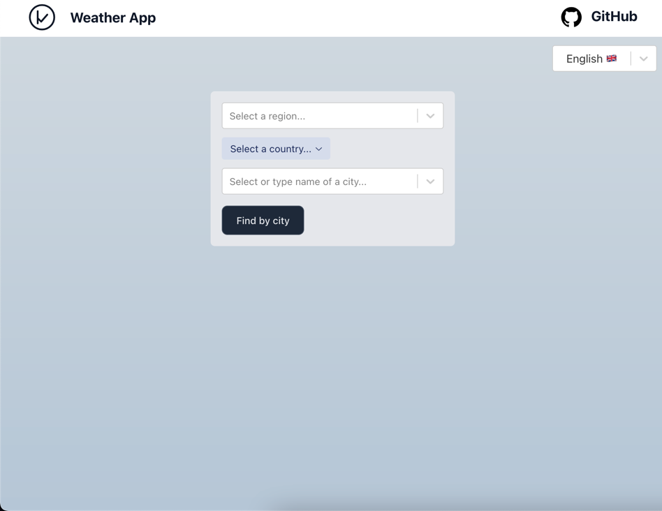
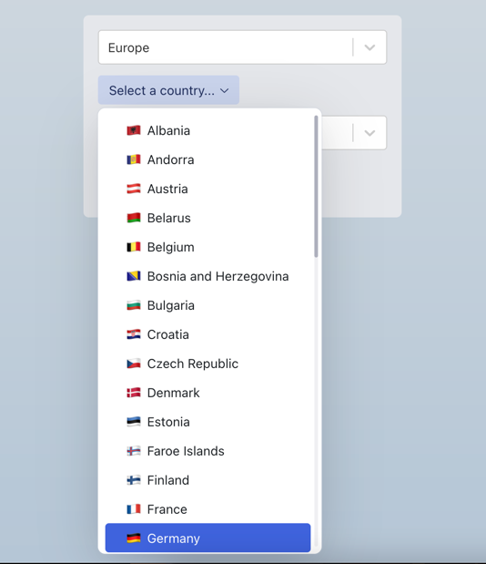
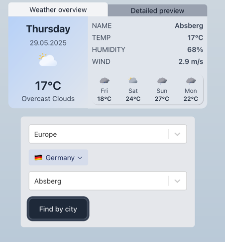
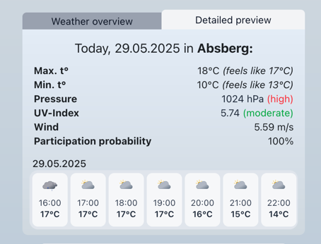
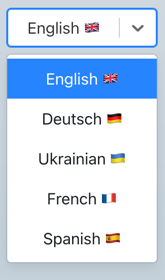

# Weather App

A modern, responsive weather application built with React, TypeScript, and TailwindCSS.  
This project demonstrates my skills in frontend development, API integration, and internationalization.

🚀 DEMO: [link]((https://rzotr2-weather-app.xyz/))

---

## ✨ Features

- **Search weather** by city, country, and region
- **Current weather**: temperature, sky condition, humidity, wind, pressure, UV index
- **Detailed hourly and daily forecast**
- **Responsive and clean UI** with mobile support
- **Tabbed navigation** (Overview / Detailed preview)
- **Visual day separators** in the hourly forecast
- **Language switcher** with instant translation
- **Internationalization** powered by [i18next](https://www.i18next.com/)
- **Light and dark theme** (optional)

---

## 🖼️ Screenshots

| Main Page                           | City Search                             | Weather Overview                          | Detailed weather review                   | Languages                                 |
|-------------------------------------|-----------------------------------------|-------------------------------------------|-------------------------------------------|-------------------------------------------|
|  |  |  |  |  |

---

## 🚀 Technologies Used

- **React** + **TypeScript**
- **TailwindCSS** for styling
- **Radix UI** for tabs
- **i18next** and **react-i18next** for internationalization (i18n)
- **OpenWeatherMap API** for weather data
- Responsive design

---

## 🌐 Internationalization

This app supports multiple languages (English, Ukrainian, German, Spanish, French) using [i18next](https://www.i18next.com/) and [react-i18next](https://react.i18next.com/).  
A language switcher menu is implemented, allowing users to instantly change the app language.

---
